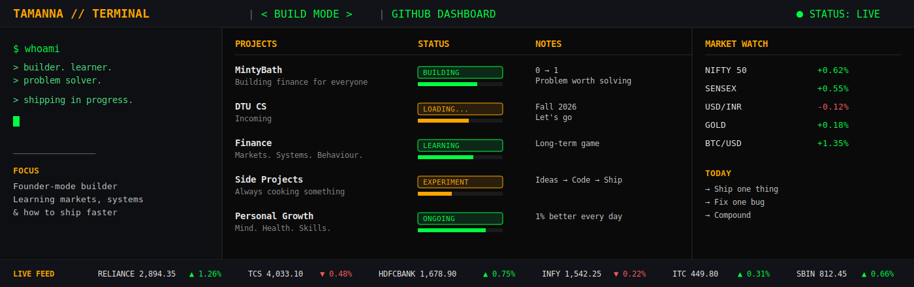

<div align="center">



</div>

<br>

```diff
+ SECURITY OVERVIEW ─────────────────────────────────────────────────────
```

```yaml
NAME:        Tamanna
ROLE:        Co-Founder @ MintyBath | Growth @ GrowthKit AI
EDUCATION:   B.Tech CSE, Delhi Technological University (incoming)
BUILDING:    Finance for everyone, one feature at a time
STATUS:      🟢 LIVE — shipping in progress
```

<br>

```diff
+ WATCHLIST ── ACTIVE POSITIONS ─────────────────────────────────────────
```

| TICKER | NAME | STATUS | NOTE |
|:------:|:-----|:------:|:-----|
| `MNTB` | **MintyBath** | 🟢 BUILD | Simulated stock trading + financial literacy app for Indian teens (11–17). ELO-based market engine w/ anti-whale mechanics. |
| `GKAI` | **GrowthKit AI** | 🟢 LIVE | Growth role — outreach, positioning, founder-mode execution |
| `ALCH` | **Alchemy** | 🟡 SHIPPED | Duolingo-style carbonyl chemistry app · RAG pipeline over YT transcripts |
| `FEST` | **Festocracy** | 🟡 SHIPPED | ELO-ranked college fest discovery platform |

<br>

```diff
+ TECH STACK ── HOLDINGS ────────────────────────────────────────────────
```

```yaml
CORE (hands-on, no copilot):
  Python · HTML · CSS

ALSO SHIP WITH (AI-paired):
  TypeScript · Node.js · Fastify · PostgreSQL · Prisma
  Socket.io · React Native · Expo · Supabase · Firebase
```

<br>

```diff
+ MARKET DEPTH ── GITHUB ACTIVITY ───────────────────────────────────────
```

<div align="center">

</div>
```diff
+ CONTRIBUTION FEED ── DAILY ACTIVITY ───────────────────────────────────
```

<div align="center">

</div>

<br>

```diff
+ STREAK ── CONSISTENCY LOG ─────────────────────────────────────────────
```

<div align="center">

</div>

<br>

```diff
+ CONNECT ── ORDER ROUTING ──────────────────────────────────────────────
```

<div align="center">

[](https://www.linkedin.com/in/tamanna-gupta--/)

</div>

<br>

```
──────────────────────────────────────────────────────────────────────────
 MARKET CLOSED. BUILD MODE: ALWAYS ON.
──────────────────────────────────────────────────────────────────────────
```
